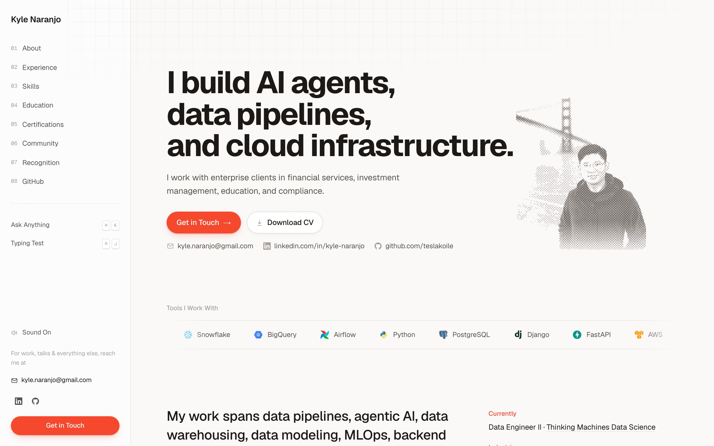

<p align="center"></p>
<h1 align="center">Kyle Naranjo</h1>
<p align="center">Personal site and portfolio of Kyle Naranjo, built with Next.js.</p>
<p align="center"><a href="https://www.kylenaranjo.cv">Live site</a></p>



## Features

- One landing page with a numbered sidebar: About, Experience, Skills, Education, Certifications, Community, Recognition, and GitHub. Each section has a switch in `app/flags.ts`, and `next dev` shows every section.
- Ask Anything (`Cmd+K` or `Ctrl+K`) matches a question to a fixed set of answers by keyword, and offers an email link when nothing matches. Typing Test opens with `Cmd+J` or `Ctrl+J`.
- GitHub contributions heatmap, rendered on the server from GitHub's public contributions page, refreshed twice a day, and recolored in the site's coral.
- Custom cursor: a coral pointer that turns into a hand over links and buttons. Pages that mount `app/_brand/Cursor.tsx` draw an animated version that morphs between the two shapes and throws a spark on click.
- Blog with posts stored as JSON in `content/blog/`. The Tiptap editor at `/blog/<slug>/edit` only runs under `next dev`, and posts can embed interactive components such as a determinant explorer and an eval grader playground. Production serves only posts marked published.
- Small sound effects made with WebAudio (no audio files), with a toggle saved in the browser.

## Run Locally

```bash
npm install
npm run dev        # http://localhost:3000
```

`npm run dev` runs `next dev --webpack`. Before calling a change done, run:

```bash
npm run lint
npx tsc --noEmit
npm run build
```

`npm run shot` takes headless screenshots into `output/screenshots/` and starts the dev server if nothing is running on port 3000. For example, `npm run shot -- / --tiles --viewport desktop` captures the whole landing page one screen at a time. If Chromium is missing, run `./scripts/install-browser.sh`.

## Deploy

The site runs on Vercel, connected to this GitHub repo. A push to `main` deploys production at https://www.kylenaranjo.cv, and each pull request gets a preview deployment. The blog editor's server actions write to the filesystem, so they refuse to run in production; write posts locally and commit them.

## Project Layout

| Path | What it is |
|------|------------|
| `app/page.tsx`, `app/_home/` | The landing page, its sections, Ask Anything, and Typing Test |
| `app/samples/sampleContent.ts` | The site's content: experience, skills, certifications, and the rest |
| `app/flags.ts` | Visibility switches for each landing section |
| `app/blog/`, `content/blog/` | Blog routes, editor, and embeds; posts as JSON |
| `app/samples/` | Design playground: options built as real routes so they can be compared rendered |
| `app/branding/`, `app/_brand/` | Brand sheet and the shared components it shows, including the drawn cursor |
| `public/` | CV, logos, hero images, cursors, icons, and the KYLLM chat mascot images |
| `scripts/` | Screenshot tool, hero and icon image builds, and the KYLLM image builds |

## Notes

Notes for coding agents are in [AGENTS.md](AGENTS.md), which [CLAUDE.md](CLAUDE.md) imports.
